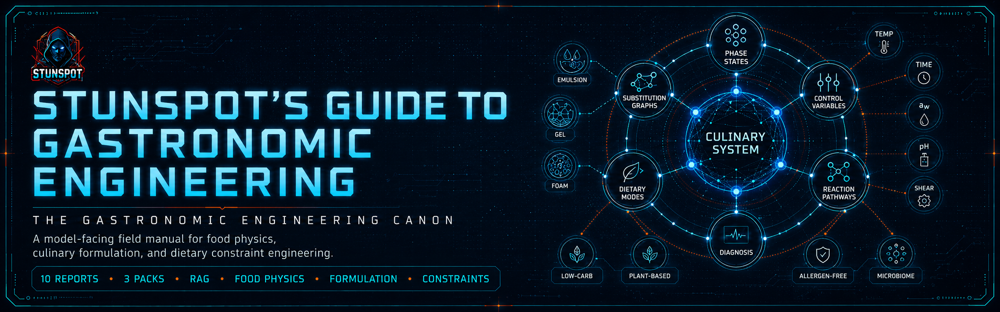

<p align="center">
  
</p>

# Stunspot's Guide to Gastronomic Engineering

**A practical canon for gastronomic engineering knowledge, reasoning, and AI/RAG use.**  
*A model-facing field substrate for deterministic food physics, culinary formulation, and dietary constraint engineering.*


[](https://doi.org/10.5281/zenodo.21039241)

A Markdown-native knowledge canon by Sam “stunspot” Walker / Collaborative Dynamics.

Its main audience is the model.

When loaded into an AI workspace, RAG pipeline, long-context session, agent memory layer, project knowledge base, or retrieval corpus, this canon gives the assisting model a dense control language for reasoning about food as engineered matter: phase states, thermodynamic variables, biochemical pathways, constraint compilers, substitution graphs, formulation failure modes, and dietary operating modes.

Human readers can use it as a field manual, but the repository is optimized for model ingestion rather than consumer cookbook friendliness. It is intended to make AI systems better at analyzing, adapting, and generating culinary formulations under real physical and dietary constraints.

The core premise is simple:

> Cooking is the controlled transformation of edible matrices. Gastronomic engineering treats texture, flavor, stability, substitution, nutrition constraints, and digestive tolerance as coupled physical systems rather than as folklore, vibes, or ingredient swaps wearing a tiny chef hat.

Use it as reference material.  
Use it as RAG substrate.  
Use it as project knowledge.  
Use it as doctrine for AI agents tasked with formulation, recipe adaptation, food-system analysis, or constraint-aware culinary reasoning.

Part of the Stunspot’s Guide to… Advanced Knowledge Base Library
Browse the full library: 
[Gateway Repo](https://github.com/Stunspot/stunspots-guides) · [stunspot.com](stunspot.com/#guides)

---

## Start Here

- [Docs Landing Page](./docs/index.md)
- [Canon Map](./docs/canon-map.md)
- [How to Use This Canon](./docs/how-to-use-this-canon.md)
- [Knowledge Packs](./docs/knowledge-packs.md)

`docs/` is the navigation and guidance layer. The source-report corpus lives in `knowledge-packs/by-report/`. Compiled upload packs live in `knowledge-packs/compiled-packs/`. The whole-corpus bundle lives in `knowledge-packs/omnibus/`.

There is no `docs/reports/` directory in this repository.

---

## Knowledge Packs

For AI Projects, RAG systems, NotebookLM-style tools, local retrieval stores, and long-context workspaces, use the packaged corpus formats under `knowledge-packs/`.

| Pack | Location | Files | Best Use |
|---|---|---:|---|
| **Source reports** | [`knowledge-packs/by-report/`](./knowledge-packs/by-report/) | 10 | Precise retrieval, selective upload, citation, editing, and per-report inspection. |
| **Compiled packs** | [`knowledge-packs/compiled-packs/`](./knowledge-packs/compiled-packs/) | 3 | Recommended default for most AI/RAG workflows: grouped coverage with manageable file count. |
| **Omnibus** | [`knowledge-packs/omnibus/`](./knowledge-packs/omnibus/) | 1 | One-file import, local archive, or strong long-context systems that handle large single sources well. |

Most users should start with the **compiled packs**. They preserve the canon sequence while avoiding both extremes: ten separate report uploads or one large omnibus file.

---

## What This Canon Covers

The canon is organized as **10 source reports**, from **A** through **J**, arranged in three functional arcs.

### A-C — Fundamentals and closed-loop formulation

These reports establish the operating language: deterministic food physics, phase-state thinking, control variables, biochemical reaction pathways, scaling laws, diagnostic loops, and experimental protocols.

- **A. Strategic Formulation Modules in Food Physics** — establishes the global formulation loop, phase states, control variables, molecular mechanisms, reaction pathways, colloids, enzymes, emulsions, gels, and failure diagnosis.
- **B. A Closed-Loop Architecture for Culinary Formulation** — turns food physics into predictive control: temperature, time, water activity, pH, ionic strength, shear, pressure, phase-state frameworks, energy transfer, and pathway navigation.
- **C. Experimental Protocols and the Closed-Loop Architecture** — extends the architecture into practicums and lab-style protocols for controlled iteration, measurement, and reproducible formulation work.

### D-F — Constraint layers for specialty dietary needs I

These reports treat common nutritional targets as explicit operating modes inside the same physical control architecture.

- **D. Low-Carb and Glycemic Control** — maps keto, diabetic-friendly, low-glycemic, sugar-free, and grain-reduced modes into carbohydrate material classes, glycemic-load logic, starch replacement physics, sweetener systems, and amorphous glass engineering.
- **E. High-Protein Systems Constraint Layer** — defines protein fortification as macro-density and structural-burden engineering, including protein solubility, hydration, denaturation, gelation, chalkiness, macro displacement, and product-class routing.
- **F. Caloric Density Control and Energy-Diluted Matrix Engineering** — formalizes low-calorie, volumetric, satiety-oriented, bariatric-aware, and lightened-food modes through energy density, water loading, air incorporation, fiber expansion, fat reduction, and sensory compensation.

### G-J — Constraint layers for specialty dietary needs II

These reports handle ingredient-exclusion, whole-food, plant-based, allergen, and digestive-tolerance regimes as constraint compilers and substitution systems.

- **G. Whole-Food and Processing-Constrained Formulation — A Physics-First Constraint Layer** — treats Whole30, paleo, primal, clean-eating, minimally processed, and additive-averse cooking as processing-intensity constraints rather than lifestyle abstractions.
- **H. Plant-Based Systems and Animal-Function Displacement** — maps vegan, vegetarian, dairy-free, egg-free, whole-food plant-based, and flexitarian modes onto functional displacement of meat, dairy, egg, gelatin, and animal-fat behaviors.
- **I. Allergen-Free Substitution Systems and Physics-First Constraint Architecture** — frames allergen exclusion as combinatorial function displacement, with hidden-source detection, exclusion vectors, cross-contact sensitivity, and stacked substitution burdens.
- **J. Digestive and Microbiome Modulation Systems** — maps low-FODMAP, gut-calm, microbiome-supportive, fermentation-aware, low-residue, stool-normalizing, reflux-aware, and tolerance-oriented cooking into substrate kinetics and digestive-burden variables.

---

## Who This Is For

This canon is useful for people and systems working with food as a technical design space:

- AI/RAG builders creating culinary, nutrition-aware, or formulation-support assistants
- prompt engineers and agent designers building food-domain reasoning tools
- chefs, formulators, and food technologists who want a physics-first reference substrate
- recipe developers adapting foods across dietary, allergen, macro, or digestive constraints
- product teams building cooking, meal-planning, health-support, or food-personalization systems
- serious learners who want the underlying mechanics instead of recipe folklore and substitution superstition

This repository is not medical, nutrition, or allergen-safety advice. Use it as formulation knowledge, not as a substitute for qualified clinical guidance, verified ingredient labels, professional food-safety review, or user-specific medical judgment.

---

## How To Read It

The canon can be read straight through, but most readers and models should enter through the problem.

### If you are building a RAG assistant

Start with the compiled packs and configure retrieval to preserve report codes, headings, and source paths. The reports are dense and terminology-rich; retrieval works best when chunks retain table context, section headings, and adjacent control-variable definitions.

### If you are adapting a recipe

Identify the target failure mode first: texture, moisture, emulsion stability, foam collapse, sweetness curve, browning deficit, digestive trigger, allergen removal, macro shift, or phase-state mismatch. Then route to the relevant report.

### If you are working under dietary constraints

Treat the named diet as an operating mode, not as a vibe. The useful move is to map the constraint to lost physical functions and replacement primitives.

### If you are using the omnibus

Use it when your system can handle large single-file sources without losing local heading structure. Otherwise, prefer the compiled packs.

---

## Repository Structure

```text
README.md                         public repository landing page
COPY_CONTEXT.md                   editorial handoff packet for this release
MANIFEST.md                       human-readable source-to-output manifest
manifest.json                     machine-readable source-to-output manifest
STATUS.md                         release maturity and corpus status
CHANGELOG.md                      release history
CITATION.cff                      citation metadata
LICENSE.md                        CC BY-NC-SA 4.0 license notice

docs/                             navigation and usage guidance only
  index.md                        docs landing page
  canon-map.md                    report sequence and corpus map
  how-to-use-this-canon.md        human and AI/RAG usage guide
  knowledge-packs.md              upload-format selection guide
  assets/brand/                   referenced hero-image location for later brand assets

knowledge-packs/by-report/        canonical individual source reports
knowledge-packs/compiled-packs/   grouped upload packs
knowledge-packs/omnibus/          whole-corpus bundle
```

---

## Release and Citation

Version: **1.0**  
Released: **2026-06-28**  
License: **CC BY-NC-SA 4.0**

Citation metadata lives in [`CITATION.cff`](./CITATION.cff). No `zenodo.json` file is included in this release; do not cite a DOI unless one is added later.

GitHub: https://github.com/Stunspot/stunspots-guide-to-gastronomic-engineering  
Pages URL, after GitHub Pages is enabled: https://stunspot.github.io/stunspots-guide-to-gastronomic-engineering/
