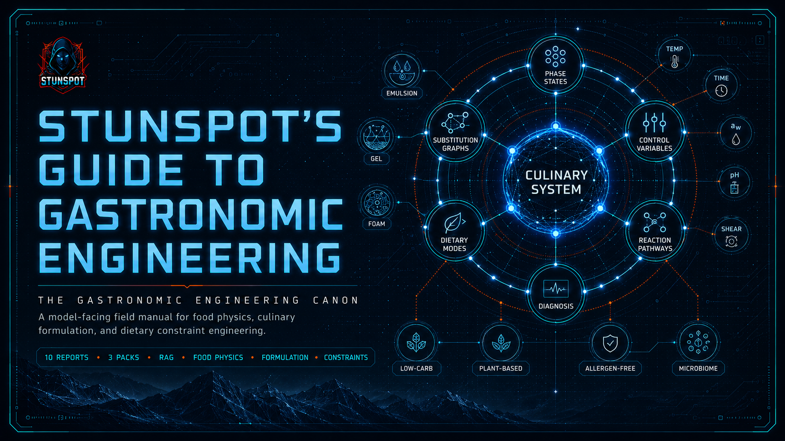

  

# Stunspot's Guide to Gastronomic Engineering

**A practical canon for gastronomic engineering knowledge, reasoning, and AI/RAG use.**

This site is the navigation layer for a model-facing knowledge canon about food as engineered matter. The corpus itself lives in the repository under `knowledge-packs/`, not inside `docs/`.

The canon is designed to help AI/RAG systems reason about culinary formulation with stable terminology and source-traceable structure: phase states, control variables, thermodynamic and biochemical pathways, constraint compilers, dietary operating modes, substitution graphs, and failure diagnosis.

It is human-readable, but its primary purpose is machine ingestion. Treat the pages here as orientation; treat the files under `knowledge-packs/` as the operational corpus.

---

## Navigation

- [Canon Map](./canon-map.md) — the report sequence and what each report contributes.
- [How to Use This Canon](./how-to-use-this-canon.md) — practical guidance for humans, AI Projects, RAG pipelines, and long-context systems.
- [Knowledge Packs](./knowledge-packs.md) — which upload format to use and why.

---

## Directory Policy

| Area | Purpose |
|---|---|
| `docs/` | Navigation, GitHub Pages metadata, and usage guidance. |
| `knowledge-packs/by-report/` | Canonical individual source reports. |
| `knowledge-packs/compiled-packs/` | Grouped upload packs for most AI/RAG workflows. |
| `knowledge-packs/omnibus/` | Whole-corpus bundle for single-file import or archive. |

There is no `docs/reports/` directory. The individual reports live only in `knowledge-packs/by-report/`.

---

## Corpus Shape

- **10 source reports** covering fundamentals, closed-loop formulation, experimental protocols, and specialty dietary constraint layers.
- **3 compiled packs** grouped as A-C, D-F, and G-J.
- **1 omnibus file** containing the whole corpus.

The recommended default for most AI/RAG workflows is the compiled-pack set.

---

## Operational Frame

This canon is best used when the model needs to answer questions like:

- What physical function did this ingredient provide before it was removed?
- Which phase state is the target food actually operating in?
- Which variable caused the failure: temperature, time, water activity, pH, ionic strength, shear, pressure, or phase geometry?
- What substitution graph restores the lost structure without violating the active dietary, allergen, or digestive constraint?
- Which report should be retrieved for low-carb, high-protein, low-calorie, whole-food, plant-based, allergen-free, or low-FODMAP formulation?

This is formulation knowledge, not medical or allergen-safety authority. Validate clinical, labeling, and safety decisions against qualified sources.
